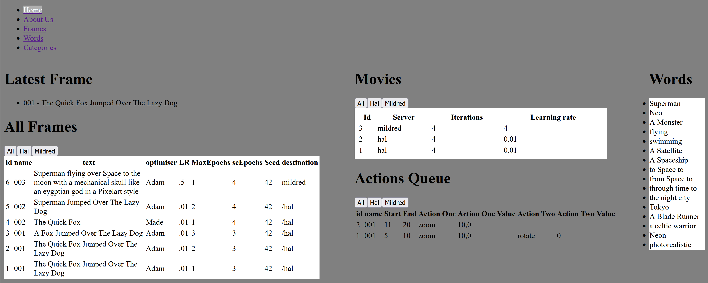
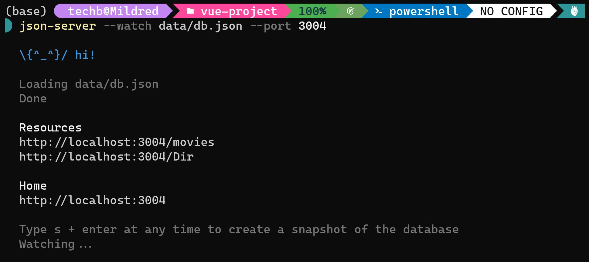
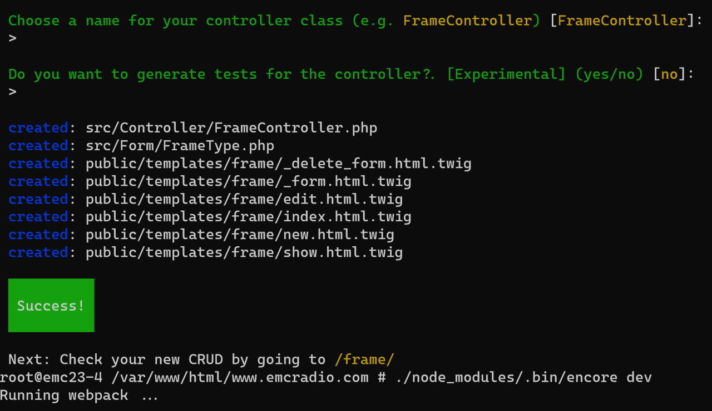

# vqganGui

A Dashboard for Vqgan movie generation scripts.

A Php rest api and Javascript frontend  to control the creation of Python Vqgan Machine learning video,audio and text.

Using:
Mysql as a backend,
Supervisord for process managment,
Symfony for admin,
and python scripts moved from Jupitor pages for the actual creation of the files.

Next:

* Add User object,
* Add Login/Admin page
* move crud to Admin

Done:

Step 1: Add the requests module to the VQGAN python script on server 2 and 3

Step 2: Add JSON SERVER node package for intermediate development
Step 3: Install Symfony 3 and create simple REST API
Step 4: Create Client with VueJS and Typescript
Step 5: Extract a set of parameters from the VQGAN generator that will be stored in the database.
Step 6: Convert Jupitor file to python script for server 2 and 3
Step 7: Adapt Python script to read in values from Server 

Server 1:  Mysql, Symfony for REST API

Server 2: Cuda, Python, Node
Server 3: Cuda, Python, Node

Client 1: VueJs, Typescript,(TensorflowJS?) Development Machine (Docker etc)
Client 2: Python Gui?
Client 3: Jupitor Notebook updated from CLIPs variation.

Json Server is great for quickly setting up data

Symfony is used  to setup all boilerplate code, Entities, Factory Objects to build and test the entities, Doctrine ORM and User management

